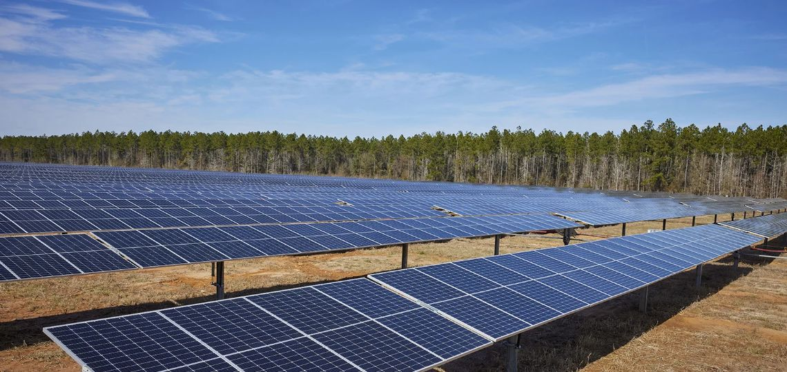
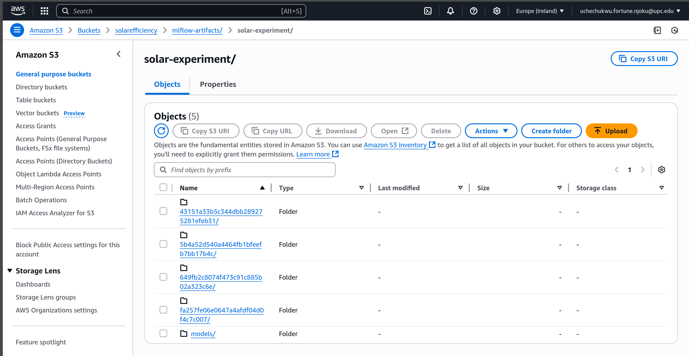
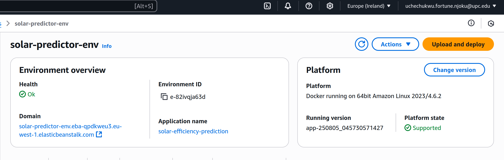
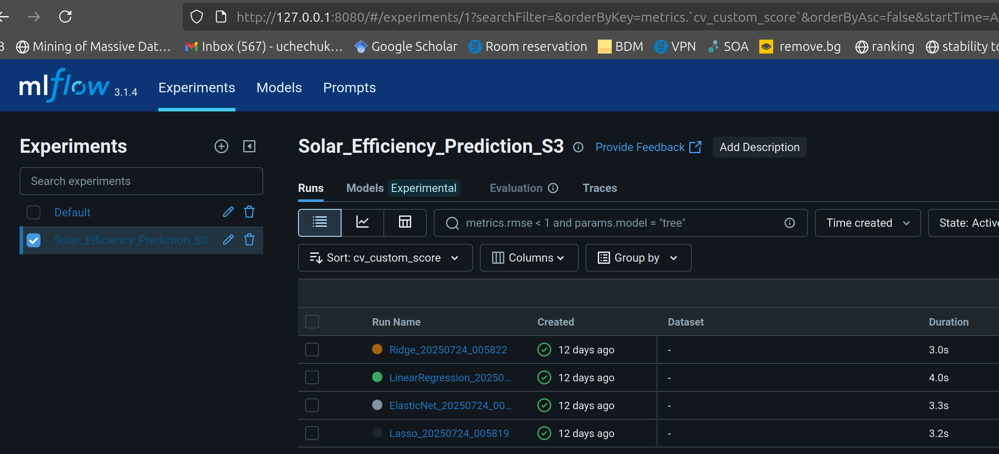
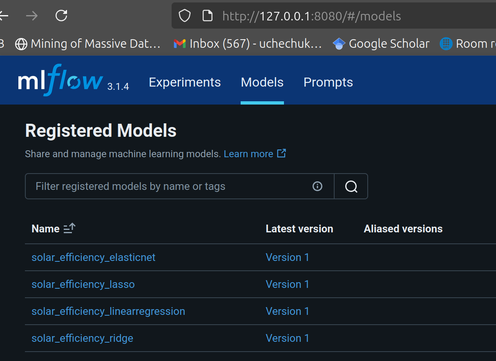
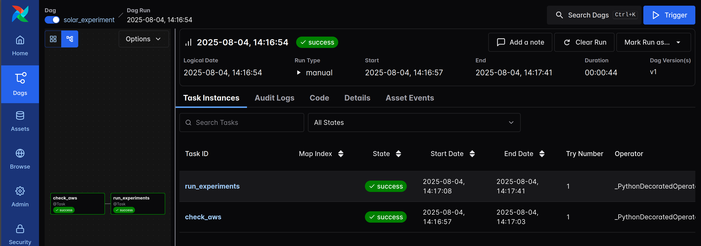
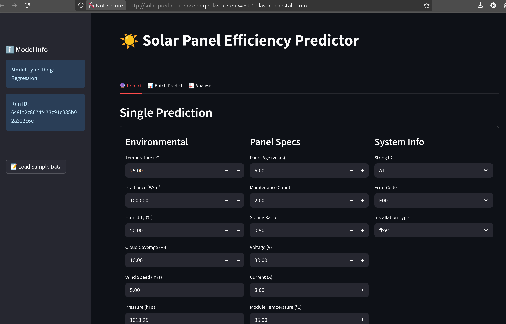

# Solar Efficiency Forecast
<p align="center">
  
</p>

## Problem Description
As solar energy systems become increasingly popular in sustainable energy infrastructures, maintaining high performance and minimizing downtime is critical. Traditional maintenance approaches for photovoltaic (PV) systems are often reactive, resulting in energy losses and higher operational costs.

The challenge is to predict performance degradation and potential failures in solar panels before they occur. Environmental conditions such as temperature, irradiance, and humidity directly influence energy output, and without predictive insights, solar farms risk operating below optimal capacity.

This project focuses on developing a Machine Learning model that leverages historical and real-time sensor data to:

    Predict solar panel performance under varying conditions.

    Identify potential failures proactively.

    Enable predictive maintenance and maximize energy output.

By solving this problem, the project contributes to smarter renewable energy management, reduced operational costs, and improved energy efficiency for solar power systems.

## **2. Project Architecture**  

The project follows a **fully cloud-integrated ML workflow**:  

1. **Data ingestion and preprocessing** using Airflow.  
2. **Model training and experiment tracking** using MLflow.  
3. **Artifact storage** in AWS S3.  
4. **Containerized model deployment** on AWS Elastic Beanstalk.  
5. **Interactive web interface** with Streamlit.

---

## **3. Features Implemented (Rubric Alignment)**  

### **Cloud** – **4 points**  
- All artifacts are stored in **AWS S3**.  
- The model is deployed in the cloud using **AWS Elastic Beanstalk**.  
- Infrastructure uses containerization for portability.  



---

### **Experiment Tracking + Model Registry** – **4 points**  
- MLflow is used to track all experiments, parameters, and metrics.  
- Best models are registered in the MLflow Model Registry for reproducibility and version control.  


---

### **Workflow Orchestration** – **4 points**  
- Airflow orchestrates the entire pipeline: from data ingestion to training and deployment.  
- The DAG runs successfully and logs are stored for transparency.  



---

### **Model Deployment** – **4 points**  
- The trained model is containerized with Docker and deployed to **AWS Elastic Beanstalk**.  
- Accessible publicly at: **[Solar Predictor App](http://solar-predictor-env.eba-qpdkweu3.eu-west-1.elasticbeanstalk.com/)**  
- Find data instances from the train or test file in the `datasets/` folder.


---

### **Reproducibility** – **4 points**  
- All dependencies listed in `requirements.txt` with version numbers.  
- Step-by-step instructions provided below for local and cloud execution.  
- Code is modular and easily extendable.

---

### **Model Monitoring** – **Not implemented**  
- Basic monitoring and alerting could be added in future versions.  

---

### **Best Practices** – **Not implemented**  
- Unit/integration tests, pre-commit hooks, and CI/CD will be considered in future work.  

---

## **4. Tech Stack**  

- **Languages & Frameworks**: Python, Streamlit  
- **ML & Experiment Tracking**: MLflow  
- **Workflow Orchestration**: Apache Airflow  
- **Cloud Services**: AWS S3, AWS Elastic Beanstalk  
- **Containerization**: Docker  

---

## **5. Setup Instructions**  

### **Clone the repository**  
```bash
git clone https://github.com/F-U-Njoku/solar-efficiency-forecast.git
cd solar-efficiency-forecast/deployment
```
### **Build image**
```bash
docker build -t solar-predictor .
```

### **Run container**
```bash
docker run -p 8501:8501 \
-e RUN_ID="649fb2c8074f473c91c885b02a323c6e" \
-e S3_BUCKET="solarefficiency" \
-e AWS_ACCESS_KEY_ID="your_key" \
-e AWS_SECRET_ACCESS_KEY="your_secret" \
solar-predictor
```

###  **Access at:** http://localhost:8501

## **6. Future Work**
- Implement model monitoring and alerting. 
- Add automated retraining pipeline. 
- Introduce CI/CD, tests, and code quality tools.
